# 100 Days Of Code - Log

### Day 0: May 27, 2021 

**Today's Progress**: Forked Repo and started my log. 

**Thoughts:** I want to learn Apache Kafka, but I'm not sure what the project will be.

**Link to work:** Project TBD
1.

### Day 1: 6/8/2021

**Today's Progress**: I started Hacker Ranks 10 Days of JS to get back in the swing of structured work. I did Day 1: Arithmetic Operators.

**Thoughts** :Started off by way over thinking it but after a few minutes realized it was easier than it looks and BOOM!

**Link(s) to work**
1.https://www.hackerrank.com/challenges/js10-arithmetic-operators/problem

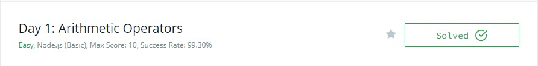

### Day 2:  6/9/2021

**Today's Progress**: Finished the Day 1 practice on Hacker Rank.

**Thoughts** :I needed to do some googling to refresh my memory, but I feel ok about that. Can't remember everything! 

**Link(s) to work**
1. https://www.hackerrank.com/challenges/js10-function/problem
2. https://www.hackerrank.com/challenges/js10-let-and-const/problem

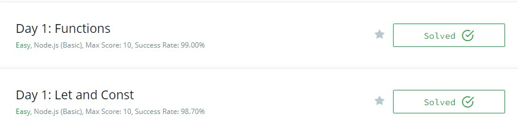

### Day 3: 

**Today's Progress**: Didn't have a lot of time today but I still got onto Hacker Rank to complete at least one challenge.

**Thoughts** : I initially did a standard If/Else statement but ended up with a more elegant solution using Math.ceil

**Link(s) to work**
1.https://www.hackerrank.com/challenges/js10-if-else/problem

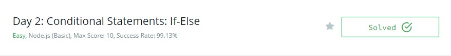

### Day 4: 

**Today's Progress**: Fell short on time again today and was only able to get to Day 2: Conditional Statements: Switch on Hacker Rank

**Thoughts** : I need to use Switch statements more often! I forgot how handy these are.

**Link(s) to work**
1.https://www.hackerrank.com/challenges/js10-switch/problem

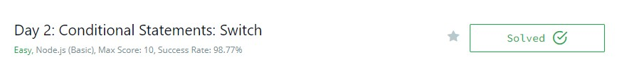

### Day 5: 6/14/2021

**Today's Progress**: Really fell behind the last few days as I went out of town then hurt my back. Got to it after work today though!

**Thoughts** : I need to practice loops more. I want to be more comfortable with modern forEach and Map

**Link(s) to work**
1.https://www.hackerrank.com/challenges/js10-loops/problem

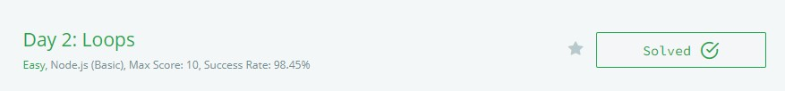

### Day 6: 6/15/2021

**Today's Progress**: Planning to focus on MongoDB going forward but will still work on JS through Hacker Rank. Completed Day 3: Arrays but may do another update tonight after working on MongoDB.

**Thoughts** : I need to start a full stack project to test all my skills.

**Link(s) to work**
1.https://www.hackerrank.com/challenges/js10-arrays/problem

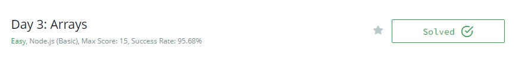

### Day 7: 6/16/2021

**Today's Progress**: Did the Day 3: Try, Catch, and Finally on Hacker Rank

**Thoughts** : I cannot remember ever doing this in the past and needed to do a good amount of googling. It is interesting and I need to try a few more problems like this.

**Link(s) to work**
1.https://www.hackerrank.com/challenges/js10-try-catch-and-finally/problem

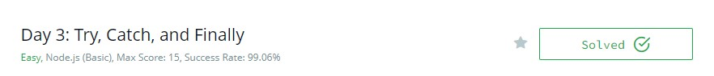

### Day 8: 6/17/2021

**Today's Progress**: Worked on Catch and Throw in Hacker Rank.

**Thoughts** : Had to google to refresh my memory but then I realized this is easier than I was thinking.

**Link(s) to work**
1.https://www.hackerrank.com/challenges/js10-throw/problem

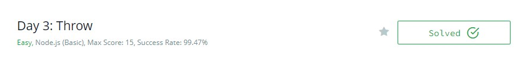

### Day 9: 6/18/2021

**Today's Progress**: Worked on the Day 4: Create a Rectangle Object problem on Hacker Rank

**Thoughts** This was a good one! I was confused what they were looking for at first but after some googling realized I could use Key Value pairs to create the rectangle.

**Link(s) to work**
1.https://www.hackerrank.com/challenges/js10-objects/problem

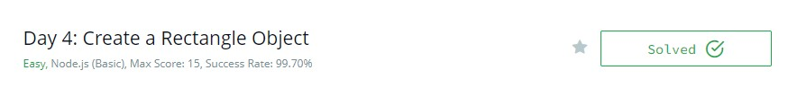

### Day 9: 6/21/2021

**Today's Progress**: Worked on Day 4: Count Objects on Hacker Rank and MERN project.

**Thoughts** : Harder than it should have been for two reasons - one, read the directions a few times to make sure you understand what they are giving you, and two, do these more often!

**Link(s) to work**
1.https://www.hackerrank.com/challenges/js10-count-objects/problem

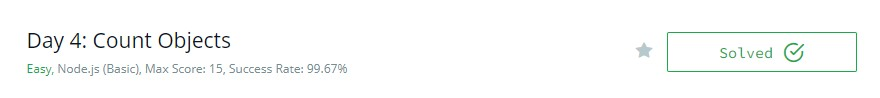

### Day 10:  6/22/2021

**Today's Progress**: Worked on Day 4: Classes and first Python project

**Thoughts** : I had forgotten all about classes and Python is cool!

**Link(s) to work**
1.https://www.hackerrank.com/challenges/js10-class/problem
2.https://github.com/ReindeerCode/Python_First_Try

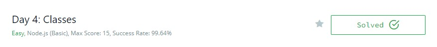

### Day 11: 6/23/3021

**Today's Progress**: Worked on Hacker Rank Day 5: Inheritance and Python project

**Thoughts** . This took way longer than it should have and I needed to do a lot of Googling.

**Link(s) to work**
1.https://www.hackerrank.com/challenges/js10-inheritance/problem

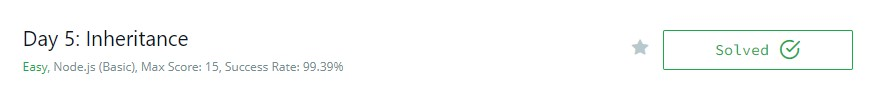

### Day ?: 

**Today's Progress**: 

**Thoughts** 

**Link(s) to work**
1.

### Day ?: 

**Today's Progress**: 

**Thoughts** 

**Link(s) to work**
1.

### Day ?: 

**Today's Progress**: 

**Thoughts** 

**Link(s) to work**
1.

### Day ?: 

**Today's Progress**: 

**Thoughts** 

**Link(s) to work**
1.

### Day ?: 

**Today's Progress**: 

**Thoughts** 

**Link(s) to work**
1.

### Day ?: 

**Today's Progress**: 

**Thoughts** 

**Link(s) to work**
1.

### Day ?: 

**Today's Progress**: 

**Thoughts** 

**Link(s) to work**
1.

### Day ?: 

**Today's Progress**: 

**Thoughts** 

**Link(s) to work**
1.

### Day ?: 

**Today's Progress**: 

**Thoughts** 

**Link(s) to work**
1.

### Day ?: 

**Today's Progress**: 

**Thoughts** 

**Link(s) to work**
1.

### Day ?: 

**Today's Progress**: 

**Thoughts** 

**Link(s) to work**
1.

### Day ?: 

**Today's Progress**: 

**Thoughts** 

**Link(s) to work**
1.

### Day ?: 

**Today's Progress**: 

**Thoughts** 

**Link(s) to work**
1.

### Day ?: 

**Today's Progress**: 

**Thoughts** 

**Link(s) to work**
1.

### Day ?: 

**Today's Progress**: 

**Thoughts** 

**Link(s) to work**
1.

